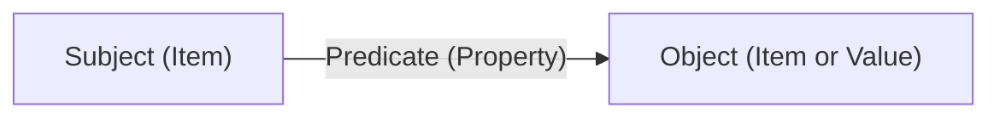

A **knowledge graph** powers every world. Worlds organizes information in a graph-based structure rather than rigid tables, allowing you to model complex relationships with precision using the W3C RDF 1.1 standard.

## Knowledge primitives

Every world is built from three fundamental building blocks.

### Items (entities)

**Items** are the distinct "things" in your world — a person, a document, a company, a task. Every item is identified by a unique **IRI** (Internationalized Resource Identifier).

```turtle
# A person
<http://example.com/alice> a <http://schema.org/Person> .

# A project
<http://example.com/project-apollo> a <http://schema.org/CreativeWork> .
```

### Properties (predicates)

**Properties** are the verbs that define how items relate. They form the grammar of your world.

```turtle
# Defined properties
http://schema.org/worksFor
http://schema.org/knows
http://example.com/ontology#assignedTo
http://example.com/ontology#hasStatus
```

### Facts (triples)

A **fact** is a triple: subject → predicate → object.



| Component | Example |
| :--- | :--- |
| **Subject** | `http://example.com/alice` |
| **Predicate** | `http://schema.org/worksFor` |
| **Object** | `http://example.com/acme-corp` |

## RDF triple syntax

Triples are written in Turtle format for readability:

```turtle
@prefix schema: <http://schema.org/> .
@prefix ex: <http://example.com/> .

# Type declaration
ex:alice a schema:Person .

# Literal value
ex:alice schema:givenName "Alice" .

# Relationship to another entity
ex:alice schema:worksFor ex:acme .

# Multiple predicates for the same subject (using semicolon)
ex:alice
    a schema:Person ;
    schema:givenName "Alice" ;
    schema:email "alice@example.com" ;
    schema:worksFor ex:acme .
```

## IRI naming conventions

IRIs should be stable, globally unique, and human-readable.

<CardGroup cols={2}>
  <Card title="Good IRI patterns" icon="check">
    ```
    http://example.com/person/alice
    http://example.com/project/apollo
    http://example.com/task/task-001
    ```

    - Use a domain you control
    - Include the entity type in the path
    - Use lowercase kebab-case for IDs
  </Card>
  <Card title="Avoid these patterns" icon="x">
    ```
    http://example.com/1234
    http://example.com/Alice Smith
    _:b0 (blank node)
    ```

    - Don't use opaque numeric IDs
    - Don't use spaces or special characters
    - Avoid blank nodes for mutable entities
  </Card>
</CardGroup>

## Graph design patterns

### Star pattern (entity hub)

All facts about an entity radiate from a central IRI. Good for people, organizations, and products:

```turtle
@prefix schema: <http://schema.org/> .
@prefix ex: <http://example.com/> .

ex:alice
    a schema:Person ;
    schema:givenName "Alice" ;
    schema:familyName "Chen" ;
    schema:email "alice@example.com" ;
    schema:telephone "+1-555-0100" ;
    schema:worksFor ex:acme ;
    schema:jobTitle "Senior Engineer" .
```

### Relationship chain

Connect entities through intermediate nodes to model complex structures:

```turtle
@prefix schema: <http://schema.org/> .
@prefix ex: <http://example.com/> .

# Alice is a member of the engineering team
ex:alice schema:memberOf ex:team-engineering .

# The engineering team is part of Acme
ex:team-engineering
    a schema:OrganizationRole ;
    schema:name "Engineering Team" ;
    schema:memberOf ex:acme .

# Query: find all of Alice's teammates
# SELECT ?colleague WHERE {
#   ex:alice schema:memberOf ?team .
#   ?colleague schema:memberOf ?team .
#   FILTER(?colleague != ex:alice)
# }
```

### Event pattern

Model things that happen at a point in time:

```turtle
@prefix schema: <http://schema.org/> .
@prefix ex: <http://example.com/> .
@prefix xsd: <http://www.w3.org/2001/XMLSchema#> .

ex:meeting-2024-05-01
    a schema:Event ;
    schema:name "Sprint Planning" ;
    schema:startDate "2024-05-01T10:00:00"^^xsd:dateTime ;
    schema:attendee ex:alice, ex:bob ;
    schema:about ex:project-hermes .
```

## Why graphs over relational tables

| Feature | Relational database | Worlds knowledge graph |
| :--- | :--- | :--- |
| **Schema changes** | Requires ALTER TABLE migrations | Add triples for new properties at any time |
| **Sparse data** | NULL columns waste space | Missing properties simply don't exist |
| **Relationships** | Fixed JOIN cardinality | Arbitrary-depth traversal with SPARQL |
| **Provenance** | Hard to track per-row | Each triple is individually addressable |
| **Portability** | Vendor-specific SQL | W3C standard RDF works across systems |

## Schema.org integration

[Schema.org](https://schema.org) provides a free, W3C-endorsed vocabulary covering people, organizations, events, products, and more. Using it as your base ontology maximizes interoperability.

```typescript
import { createWorldsSdk } from "@wazoo/worlds-sdk";

const sdk = createWorldsSdk({
  baseUrl: "http://localhost:8000",
  apiKey: Deno.env.get("WORLDS_API_KEY")!,
});

const turtle = `
@prefix schema: <http://schema.org/> .
@prefix ex: <http://example.com/> .

# Team members
ex:alice
    a schema:Person ;
    schema:givenName "Alice" ;
    schema:worksFor ex:acme .

ex:bob
    a schema:Person ;
    schema:givenName "Bob" ;
    schema:worksFor ex:acme ;
    schema:knows ex:alice .

# Organization
ex:acme
    a schema:Organization ;
    schema:name "Acme Corp" ;
    schema:url <https://acme.example.com> .
`;

await sdk.worlds.import("my-world", turtle, { format: "turtle" });
```

## Querying the graph

See the [Querying guide](/guides/querying) for the full SPARQL reference. A quick example to retrieve all facts about an entity:

```typescript
const result = await sdk.worlds.sparql("my-world", `
  PREFIX schema: <http://schema.org/>
  PREFIX ex: <http://example.com/>

  SELECT ?predicate ?object WHERE {
    ex:alice ?predicate ?object .
  }
`);

if (result && "results" in result) {
  for (const binding of result.results.bindings) {
    console.log(
      binding.predicate.value.split("/").pop(),
      ":",
      binding.object.value
    );
  }
}
```

<Tip>
Start with schema.org for common entity types. Only define custom ontology classes and properties when schema.org doesn't cover your domain. This keeps your graph interoperable and makes it easier for agents to reason about the schema.
</Tip>
