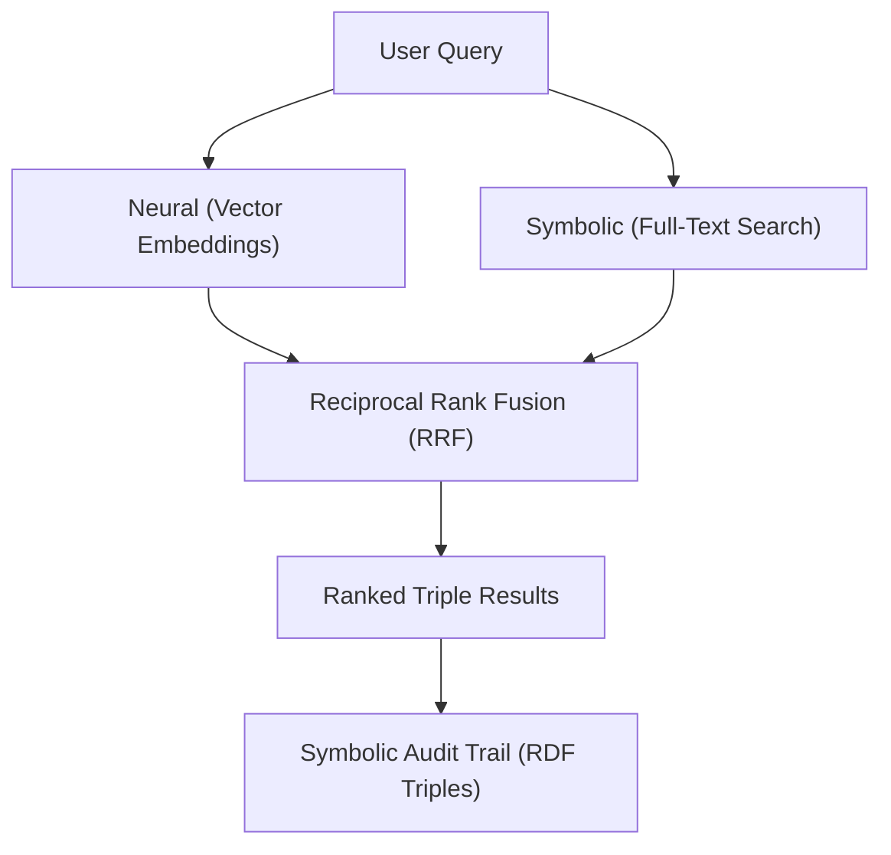

Worlds combines vector embeddings and full-text search into a single hybrid retrieval pipeline. Results are ranked using **Reciprocal Rank Fusion (RRF)** and returned as scored RDF triples — every result traces back to a verifiable fact in the graph.

## How it works



When you call `sdk.worlds.search()`, the server:

1. Embeds the query text using the configured embedding model.
2. Executes a vector similarity search over stored chunk embeddings.
3. Executes a full-text search over stored chunk text.
4. Merges both result sets using RRF to produce a single ranked list.
5. Returns each result as a `TripleSearchResult` with its subject, predicate, object, and score.

## Basic usage

```typescript
import { createWorldsSdk } from "@wazoo/worlds-sdk";

const sdk = createWorldsSdk({
  baseUrl: "http://localhost:8000",
  apiKey: Deno.env.get("WORLDS_API_KEY")!,
});

const results = await sdk.worlds.search("my-world", "find people related to ethan", {
  limit: 10,
});

for (const result of results) {
  console.log(result.subject, result.predicate, result.object);
  console.log("Score:", result.score);
}
```

## Search result structure

Each result is a `TripleSearchResult`:

```typescript
interface TripleSearchResult {
  subject: string;        // IRI of the subject entity
  predicate: string;      // IRI of the predicate
  object: string;         // IRI or literal value of the object
  vecRank: number | null; // Position in vector search results (null if not found)
  ftsRank: number | null; // Position in full-text results (null if not found)
  score: number;          // Final RRF score (higher is more relevant)
  worldId?: string;       // Source world ID (for multi-world searches)
}
```

## Search parameters

| Parameter | Type | Default | Description |
| :--- | :--- | :--- | :--- |
| `query` | `string` | required | Natural language search query |
| `limit` | `number` | `20` | Maximum results to return (max `100`) |
| `subjects` | `string[]` | `[]` | Filter to triples with these subject IRIs |
| `predicates` | `string[]` | `[]` | Filter to triples with these predicate IRIs |
| `types` | `string[]` | `[]` | Filter to entities of these `rdf:type` values |

## Graph-filtered search

Combine semantic search with graph constraints to narrow results to relevant entities:

```typescript
// Search for information about a specific entity
const results = await sdk.worlds.search(
  "my-world",
  "find people related to ethan",
  {
    limit: 10,
    subjects: ["http://example.com/ethan"],
    predicates: ["http://schema.org/relatedTo"],
  }
);
```

### Filter by entity type

```typescript
// Only return results for Person entities
const results = await sdk.worlds.search(
  "my-world",
  "software engineers working on AI",
  {
    limit: 20,
    types: ["http://schema.org/Person"],
  }
);
```

### Filter by multiple predicates

```typescript
// Find employment-related facts
const results = await sdk.worlds.search(
  "my-world",
  "Alice's work and projects",
  {
    limit: 15,
    subjects: ["http://example.com/alice"],
    predicates: [
      "http://schema.org/worksFor",
      "http://schema.org/workLocation",
      "http://schema.org/jobTitle",
    ],
  }
);
```

## Using the REST API directly

```bash
# Basic search
curl "http://localhost:8000/worlds/my-world/search?query=people+working+on+AI&limit=10" \
  -H "Authorization: Bearer $WORLDS_API_KEY"

# With subject and predicate filters
curl "http://localhost:8000/worlds/my-world/search?query=ethan&subjects=http://example.com/ethan&predicates=http://schema.org/relatedTo" \
  -H "Authorization: Bearer $WORLDS_API_KEY"
```

## Reciprocal Rank Fusion (RRF)

The RRF algorithm merges two ranked lists into a single relevance ranking without needing to calibrate raw scores across different retrieval systems.

The formula used:

$$score = \sum_{d \in D} \frac{1}{k + rank(d)}$$

Where $k = 60$ and $rank(d)$ is the position of the triple in the respective result set. Results that appear in both the vector and full-text result sets receive a higher combined score.

## Embedding providers

The quality of semantic search depends on the embedding model configured on the server. Two providers are supported:

<Tabs>
  <Tab title="OpenRouter">
    Cloud-based embeddings via OpenRouter. Recommended for production.

    ```bash
    OPENROUTER_API_KEY="sk-or-..."
    OPENROUTER_EMBEDDINGS_MODEL="openai/text-embedding-3-small"
    WORLDS_EMBEDDINGS_DIMENSIONS="1536"
    ```
  </Tab>

  <Tab title="Ollama">
    Local embeddings via Ollama. Useful for development or air-gapped environments.

    ```bash
    OLLAMA_BASE_URL="http://localhost:11434"
    OLLAMA_EMBEDDINGS_MODEL="nomic-embed-text"
    WORLDS_EMBEDDINGS_DIMENSIONS="768"
    ```
  </Tab>
</Tabs>

## Hybrid search strategy

For complex retrieval tasks, combine semantic search with graph traversal:

```typescript
async function hybridRetrieve(
  worldId: string,
  naturalLanguageQuery: string,
  entityType: string
) {
  // Step 1: Semantic search to find relevant entities
  const searchResults = await sdk.worlds.search(worldId, naturalLanguageQuery, {
    limit: 10,
    types: [entityType],
  });

  // Step 2: Collect unique subject IRIs
  const subjects = [...new Set(searchResults.map((r) => r.subject))];
  if (subjects.length === 0) return [];

  // Step 3: Graph expansion via SPARQL
  const values = subjects.map((s) => `<${s}>`).join(" ");
  const expanded = await sdk.worlds.sparql(worldId, `
    PREFIX schema: <http://schema.org/>

    SELECT ?subject ?name ?description WHERE {
      VALUES ?subject { ${values} }
      ?subject schema:name ?name .
      OPTIONAL { ?subject schema:description ?description . }
    }
  `);

  return { searchResults, graphExpansion: expanded };
}
```

<Note>
The `limit` parameter is capped at 100 per request. For large-scale retrieval, issue multiple queries with different filters or use SPARQL directly for full graph traversal.
</Note>

## Relevance tuning

The RRF fusion naturally favors results that appear in both retrieval channels. To improve relevance:

- **More specific queries** produce better vector matches. Avoid one-word queries.
- **Add `subjects` filters** when you know the entity you're asking about.
- **Add `types` filters** to restrict results to relevant entity categories.
- **Use `predicates` filters** when you want facts of a specific kind (e.g., only `schema:worksFor` relationships).
