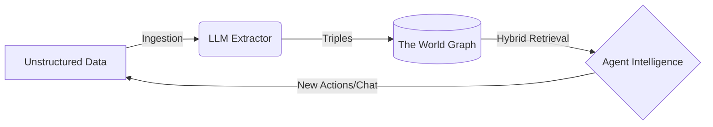

Worlds provides a structured framework for **agent memory**. Instead of treating an agent's context as a flat list of chat logs or disjointed text chunks, Worlds organizes information as a **dynamic, queryable model of reality**.

## The Worlds pipeline

To understand how Worlds powers intelligent agents, you must understand the lifecycle of data moving through the platform.



<AccordionGroup>
  <Accordion title="Ingestion">
    Raw information enters the system from user chats, GitHub repositories, PDFs, or direct SPARQL `INSERT DATA` operations. At this stage, data may remain unstructured human language or structured RDF.
  </Accordion>
  <Accordion title="Neuro-symbolic engine">
    The Worlds engine uses LLMs to extract meaning and entities. It translates ambiguous language into structured **triples** (subject → predicate → object). These facts merge into a **world** — an isolated container where the graph evolves through:

    - **Updating** conflicting facts.
    - **Extending** existing entities with new context.
    - **Inferring** hidden relationships via symbolic reasoning.
  </Accordion>
  <Accordion title="Retrieval">
    When an agent needs context, it performs a **hybrid search**. This process mixes semantic vector similarity with deterministic graph traversal to pull a high-precision slice of reality directly into the context window.
  </Accordion>
</AccordionGroup>

## SPARQL 1.1 support

The Worlds API supports the full SPARQL 1.1 query and update language via the Comunica engine. This includes:

- `SELECT`, `CONSTRUCT`, `ASK`, and `DESCRIBE` queries
- `INSERT DATA`, `DELETE DATA`, `DELETE/INSERT WHERE` updates
- Named graphs and graph patterns
- Aggregation, filters, and optional patterns

```typescript
// Complex multi-hop query example
const result = await sdk.worlds.sparql(
  worldId,
  `
  SELECT ?name ?title WHERE {
    ?person <http://schema.org/memberOf> <http://example.com/engineering-team> .
    ?person <http://schema.org/givenName> ?name .
    ?person <http://schema.org/jobTitle> ?title .
  }
  ORDER BY ?name
`,
);
```

## Hybrid search with RRF

The platform utilizes **Reciprocal Rank Fusion (RRF)** to combine results from distinct indices into a single, unified relevance ranking.

- **Semantic search**: Captures conceptual meaning using a vector index and high-dimensional embeddings (1536-dim).
- **Keyword search (FTS5)**: Provides exact term matching using the BM25 ranking algorithm.
- **Graph context**: Restricts search results based on structural RDF relationships using subject or predicate filters.

```typescript
// Hybrid search with graph filters
const results = await sdk.worlds.search(
  worldId,
  "cozy venues in New York",
  {
    limit: 10,
    types: ["http://schema.org/LocalBusiness"],
    predicates: ["http://schema.org/address"],
  },
);
```

The RRF formula fuses vector and keyword rankings:

$$score = \sum_{d \in D} \frac{1}{60 + rank(d)}$$

## Import and export

You can import and export world data in standard RDF formats.

<Tabs>
  <Tab title="Import">
    ```typescript
    // Import Turtle data
    await sdk.worlds.import(
      worldId,
      `
      @prefix schema: <http://schema.org/> .
      <http://example.com/alice> schema:givenName "Alice" ;
                                 schema:jobTitle "Engineer" .
      `,
      { format: "turtle" },
    );
    ```

    Supported import formats:

    | Format | MIME type |
    | :--- | :--- |
    | Turtle | `text/turtle` |
    | N-Triples | `application/n-triples` |
    | N3 | `text/n3` |
    | N-Quads | `application/n-quads` |
  </Tab>
  <Tab title="Export">
    ```typescript
    // Export as Turtle
    const buffer = await sdk.worlds.export(worldId, { format: "turtle" });
    const text = new TextDecoder().decode(buffer);
    console.log(text);
    ```

    Supported export formats: `turtle`, `n-triples`, `n3`, `n-quads`.
  </Tab>
</Tabs>

## Logging

Every world records an event log. Retrieve logs to monitor agent activity and debug queries.

```typescript
const logs = await sdk.worlds.listLogs(worldId, {
  page: 1,
  pageSize: 50,
  level: "info",
});

console.log(logs);
```

## Storage engine

To achieve both semantic flexibility and structural precision, the storage engine employs a hybrid strategy.

Worlds uses an in-memory, WASM-compiled RDF store (`n3`) that supports SPARQL. The infrastructure supports any RDF store — including Apache Jena Fuseki or a local file system — that implements `rdf-patch` forward synchronization.

### SQLite schema

| Table | Purpose |
| :--- | :--- |
| `triples` | Atomic units of knowledge (Subject, Predicate, Object) |
| `chunks` | Overlapping text segments with vector embeddings |
| `entity_types` | Optimized mapping from entities to `rdf:type` IRIs |
| `blobs` | Large-scale RDF data and file-based state |

- **Pre-loading**: WASM modules are pre-loaded to ensure "warm" isolates.
- **Hydration**: The SQLite system-of-record hydrates the graph state upon initialization.
- **Edge cache**: Hot state persists in the edge cache between requests for millisecond read latency.

## Provider agnostic

Worlds works with any LLM or agent framework. The platform does not lock you into a model provider.

<CardGroup cols={3}>
  <Card title="OpenAI" icon="robot">GPT-4o, o3, text-embedding-3-small</Card>
  <Card title="Anthropic" icon="brain">Claude 3.5, Claude 4</Card>
  <Card title="Google" icon="google">Gemini, text-embedding-004</Card>
  <Card title="xAI" icon="x">Grok</Card>
  <Card title="DeepSeek" icon="magnifying-glass">DeepSeek models</Card>
  <Card title="Ollama" icon="server">Local models via Ollama</Card>
</CardGroup>

<Tip>
  For deeper technical details on the storage engine and hybrid search algorithm, see the [Whitepaper](/overview/whitepaper).
</Tip>
